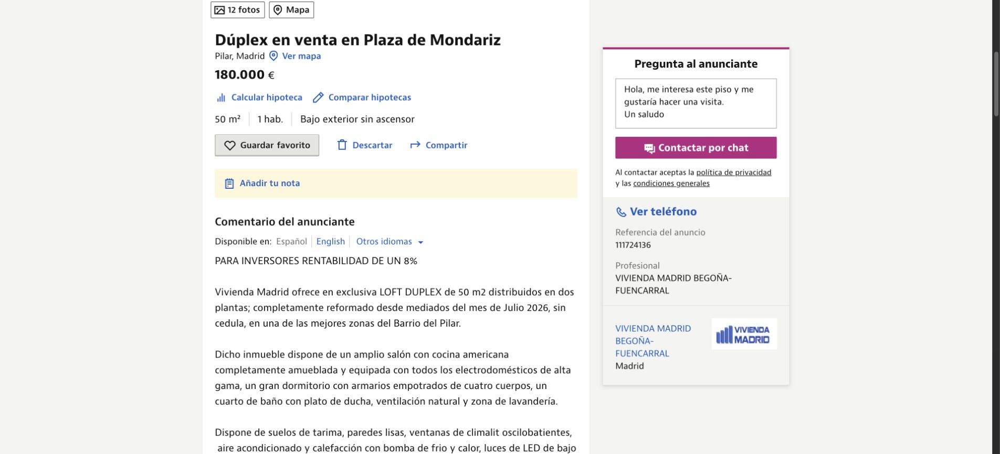

<p align="center">
  
</p>

<h1 align="center">Irrealista</h1>

<p align="center">
  <strong>Tu criterio inmobiliario, directamente sobre Idealista.</strong><br>
  Una extensión de Chrome que ordena anuncios según lo que de verdad te importa — y señala los que conviene descartar.
</p>

<p align="center">
  
  
  
  
</p>

---

## La idea

Idealista permite filtrar. Irrealista ayuda a **decidir**.

Puntúa cada anuncio visible con un modelo explicable de 0–100, permite ordenarlo desde la barra nativa y lleva a cada tarjeta las señales que normalmente se pierden entre fotos bonitas y texto comercial: €/m², altura, ascensor, exterior, reforma, habitabilidad y minutos reales andando al metro.

<p align="center">
  
</p>

> Captura de una búsqueda real de áticos de lujo en Madrid. El anuncio mostrado es efímero y puede dejar de estar disponible; la captura ilustra la interfaz, no una recomendación de compra.

## No todo lo bien reformado es hipotecable

La extensión no confunde un anuncio bonito con una vivienda viable. En este ejemplo real, el texto anuncia un loft “sin cédula”; Irrealista lo marca como un descarte explícito.

<p align="center">
  
</p>

Los ejemplos se han tomado de anuncios públicos de Idealista: un [ático en Palacio](https://www.idealista.com/inmueble/107858732/) y un [loft sin cédula en Pilar](https://www.idealista.com/inmueble/111724136/). Sus precios, textos y disponibilidad pueden cambiar.

## Qué mira

| Señal | Cómo influye |
| --- | --- |
| Precio, superficie y €/m² | Son los pesos principales del score. |
| Planta + ascensor | Se evalúan juntos: planta alta con ascensor gana; alta sin ascensor penaliza mucho. |
| Exterior, orientación y espacio exterior | Premian luz, ventilación y disfrute real. |
| Año, m² útiles, energía y calefacción | Añaden contexto de edificio y confort. |
| Reforma, trastero y aire acondicionado | Ajustan el score sin eclipsar las señales decisivas. |
| Metro | Muestra estación, líneas, distancia y tiempo a pie calculado por ruta. |

### Descartes duros

Un score atractivo no compensa una operación inviable. Estos casos pasan a **“No cumple tus filtros”**:

- Subasta, cesión de remate, compra al contado o texto que indica que no se puede hipotecar.
- Sin posesión, alquilado u ocupado.
- Uso registral de local / cambio de uso.
- Sin cédula o licencia de habitabilidad.

## Instalar en modo desarrollador

```bash
npm ci
npm run build
```

1. Abre `chrome://extensions`.
2. Activa **Modo de desarrollador**.
3. Pulsa **Cargar descomprimida** y selecciona `dist/`.
4. En cualquier búsqueda de Idealista aparecerán los chips de score y el botón **Tu score** dentro de las opciones nativas de ordenar.

## Configuración

En la página de opciones de la extensión puedes ajustar los pesos y configurar:

- Un endpoint compatible con OpenAI (URL base, modelo, clave y visión opcional).
- OpenRouteService para rutas a pie; las rutas se cachean por anuncio.

Las claves se guardan en el almacenamiento local del navegador. No se incluyen en el bundle, no se leen de `.env` y no se suben a este repositorio. El score actual es determinista: sigue funcionando aunque no configures ningún proveedor de IA.

## Desarrollo

```bash
npm test
npx tsc --noEmit
npm run build
```

La implementación es TypeScript sin framework: content script para la UI, service worker para caché/rutas y `chrome.storage.local` para preferencias y resultados.

## Nota

Irrealista es una ayuda para comparar anuncios, no asesoramiento financiero, técnico o legal. Antes de comprar, confirma siempre la situación registral, urbanística, de habitabilidad y financiación con profesionales independientes.
